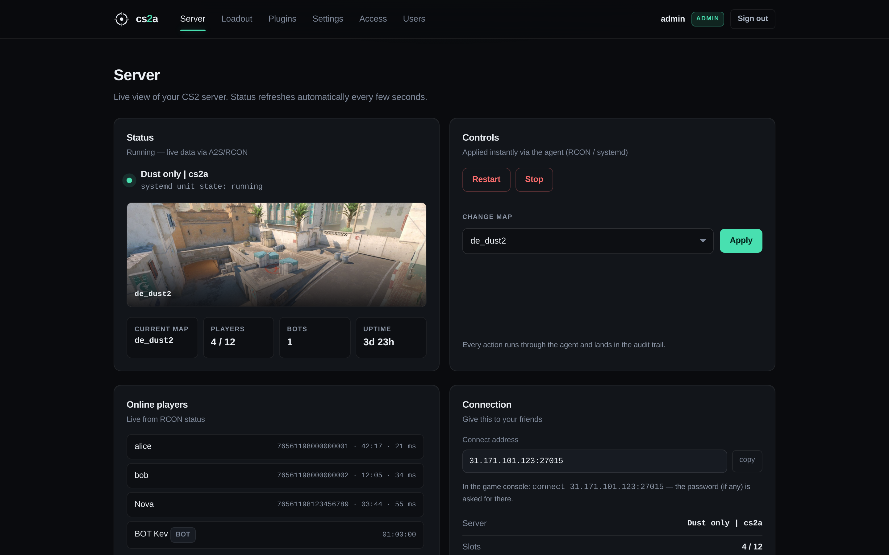
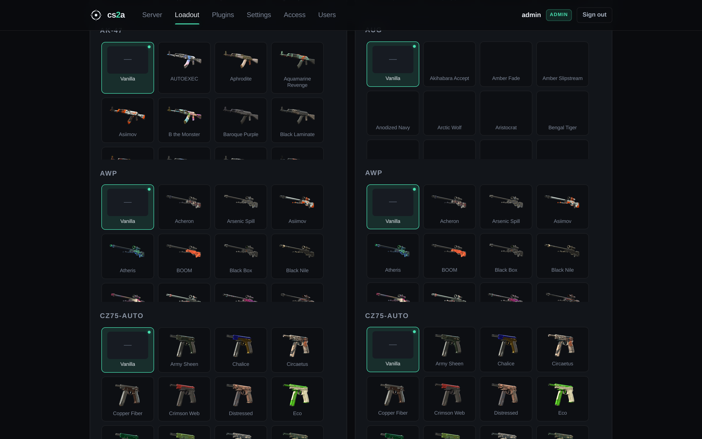
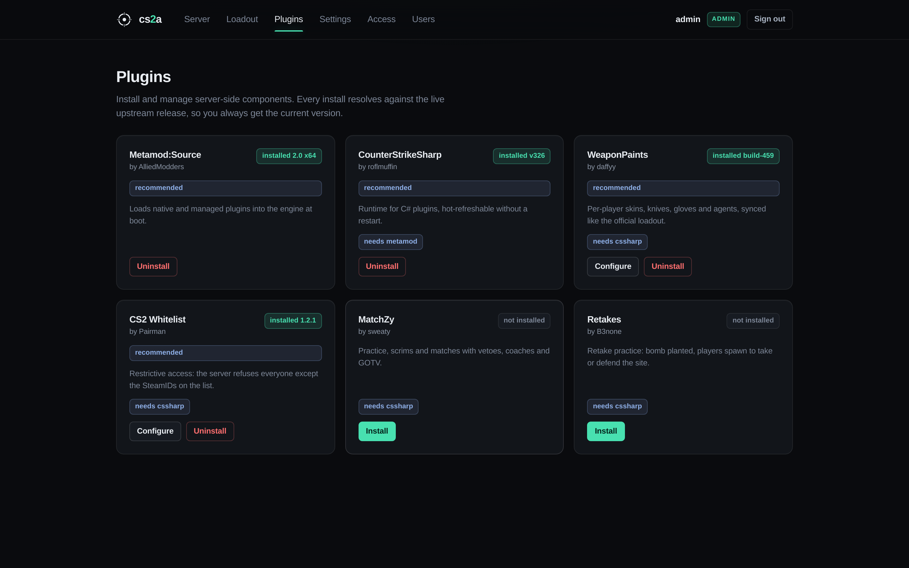
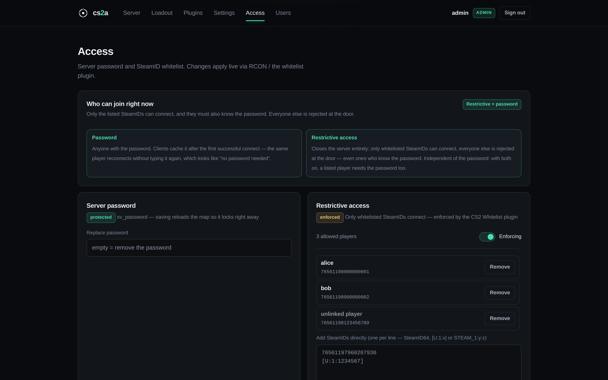

<div align="center">

<a href="https://elvonpiko.github.io/cs2a/"><picture>
<source media="(prefers-color-scheme: dark)" srcset="docs/img/favicon.svg">
</picture></a>

# cs2a

**A Counter-Strike 2 server manager that stays out of the way.**

Web panel for admins and players, plus a small agent on the VPS.
Two Go binaries, SQLite, no containers, no runtime.

[](https://elvonpiko.github.io/cs2a/)
&nbsp;
[](../../releases)
&nbsp;

&nbsp;


</div>

---

<table>
<tr>
<td width="50%" align="center"><sub><b>The server page</b> — live status, players, the update card</sub></td>
<td width="50%" align="center"><sub><b>The loadout picker</b> — skins per player, per side</sub></td>
</tr>
<tr>
<td></td>
<td></td>
</tr>
<tr>
<td align="center"><sub><b>The plugin catalog</b> — one click, current releases</sub></td>
<td align="center"><sub><b>Access</b> — password plus a named whitelist</sub></td>
</tr>
<tr>
<td></td>
<td></td>
</tr>
</table>

---

## Install

Fresh Ubuntu/Debian VPS, as root:

```sh
curl -fsSL https://elvonpiko.github.io/cs2a/install.sh | sudo bash
```

The installer discovers before it asks. It looks for SteamCMD, an existing CS2 install, its systemd unit, the game port, the address the unit binds, the account it runs as, the RCON password in `server.cfg`, Caddy and ufw — then installs and configures only what is missing. On a bare VPS that means SteamCMD, the CS2 server (~40 GB), the systemd units, firewall rules and the panel; on a machine that already runs CS2 it means the panel and agent alone, with your unit file left untouched.

Adopting a running server is the case that gets the most care: the agent dials exactly the address your launch line binds (not an assumed `127.0.0.1`), writes files as the user your unit already runs as, and tells you when `-usercon` is missing — the one flag without which CS2 never opens its RCON port, so map changes and console commands cannot work. It offers to add that flag through a systemd drop-in, leaving your unit file byte-for-byte as you wrote it.

Reruns are safe: the agent token, admin password, RCON password and skin-database credentials are reused rather than rotated.

```sh
sudo bash scripts/bootstrap.sh --no-cs2            # never install the game
sudo bash scripts/bootstrap.sh --domain cs.example # panel over HTTPS via Caddy
sudo bash scripts/bootstrap.sh --panel-local       # panel on loopback (use an SSH tunnel)
sudo bash scripts/bootstrap.sh --unattended        # no questions, all defaults
```

You are asked at most a handful of questions, and never for something the machine can answer itself. Give it a domain and Caddy provides automatic HTTPS with proxy timeouts long enough for plugin installs; without one the panel serves plain HTTP on `:8080` and says so, since your password would otherwise cross the network in the clear.

Uninstall: `sudo bash scripts/uninstall.sh` (add `--purge` for config and data, `--purge-game` for the CS2 install). A unit cs2a did not write is never removed, but the drop-in and Caddy site it added are.

## What you get

*The four screenshots above are the real panel, captured from a demo server with three players online and a pending CS2 update — not mockups. `go run ./tools/cs2a-demo` boots the same UI locally.*

**Admins**
- Live server page — status, players, uptime, map; start/stop/restart with confirm dialogs; the log card tails a running server by itself (pausable, follows your scroll)
- Lifecycle actions that tell the truth: the agent waits for the unit to settle and brings back the journal tail when a start fails, instead of reporting success the moment `systemctl` exits
- A diagnosed RCON problem instead of `connection refused`: the panel names the cause (wrong bind address, no `-usercon`, no boot-time password) and offers a one-click repair
- Map changes that **keep everyone connected** (`changelevel`; only a restart drops players)
- One-click plugin catalog — Metamod:Source, CounterStrikeSharp, WeaponPaints, MatchZy, retakes, deathmatch, admin tools — always resolving the current upstream release, with a JSON config editor per plugin. The four cs2a builds its own UI on (Metamod, CSSharp, WeaponPaints, the whitelist) are badged **recommended** on the page
- The recommended stack on a fresh install: bootstrap asks (default yes, `--vanilla` declines) and the agent queues the installs as jobs on its first boot, visible on the Plugins page like any install
- Installs run as background jobs with a live progress bar (byte-accurate during downloads), so a 50 MB download cannot time out the request; finished installs update their cards without a reload
- Server password and SteamID whitelist, applied live — no restart. Enforcement stays off until the list has someone on it, because an enforced empty whitelist locks out the operator too
- One honest caveat about the recommended stack: Valve update days occasionally break Metamod/CSSharp for a few hours until upstream catches up, and auto-update will still install the CS2 update the moment the server is empty. When that happens the Server page shows the crash loop with the journal tail and the Plugins page has the fix as soon as upstream ships it. `--vanilla` at install keeps a server that never breaks this way (the trade is the missing loadout and restrictive access until you install the plugins yourself)
- CS2 server updates: the agent compares the installed build with Steam's and installs updates on its own when the server is empty or offline — so an updated client never hits "client out of date" for long. The Server page shows the builds, the auto-update state, and a manual Update now for when you don't want to wait
- Panel accounts (admin/player) with an audit trail; failed sign-ins are throttled, expired sessions are swept, and signing out invalidates the token server-side

**Players**
- Server info, read-only
- Map change (the one action they get)
- Loadout: knife, gloves, agent and weapon skins per side, picked from image galleries and synced to the server per SteamID — like the official in-game loadout. The tab appears only when the admin installed WeaponPaints and the account has a linked SteamID: without either there is no loadout to manage

## How it fits together

```
browser → cs2a-panel :8080 (SSR + htmx, sessions, SQLite)
            └─ loopback :8100, bearer token → cs2a-agent
                                                 ├─ RCON + A2S → CS2 server
                                                 └─ configs, plugins, whitelist, systemd
```

The agent never listens on a public interface — it refuses a non-loopback bind unless explicitly overridden — and the panel talks to it over loopback with a generated token compared in constant time. Panel forms are protected by Go's `CrossOriginProtection`; set a domain and cookies become `Secure` automatically. Files the agent installs into the game tree are handed to the account the game runs as, since the agent is root and the game is not.

RCON and A2S are implemented in-repo against the wire format, so a `status` reply longer than one 4096-byte packet and a split A2S answer both come back complete — and when one genuinely cannot be reassembled, the panel shows the players it did parse *and* says the answer was incomplete, rather than quietly reporting a smaller server.

## Development

```sh
scripts/devenv.sh       # source me: writable Go caches
go tool templ generate  # after editing internal/panel/web/**/*.templ
make test               # go test ./...
make build              # dist/cs2a-agent + dist/cs2a-panel
bash tests/bootstrap_test.sh
```

The screenshots in `docs/img` are the real panel, captured by Playwright against `tools/cs2a-demo` (the production panel serving a fake agent's demo state):

```sh
go run ./tools/cs2a-demo &                # demo panel on :8800 (admin / demo-password)
node scripts/shots/capture.mjs docs/img    # needs: npm i playwright-core + its chromium
```

```
cmd/               panel + agent entrypoints
internal/agent     runtime: RCON, A2S, systemd, plugins, jobs, cosmetics
internal/panel     HTTP server, sessions, agent client, templ views
internal/cs2       SteamIDs, status parsing, server.cfg managed blocks
internal/bootstrap install plan, unit/config rendering, secret generation
scripts/           bootstrap.sh installer, install.sh wrapper, uninstall.sh, shots/
tools/             cs2a-demo: the real panel against a fake agent, for screenshots
tests/             shell tests for the installer
```

## Status

Working MVP, a weekend-hobby project — use at your own risk. Both services currently run as root; see `docs/PLAN.md` for planned hardening and `docs/PLUGINS.md` for how the plugin stack works under the hood.
